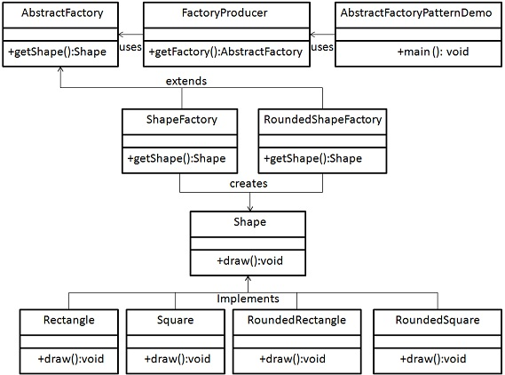

# Abstract Factory Pattern

Abstract Factory patterns work around a super-factory which creates other factories. This factory is also called as factory of factories. This type of design pattern comes under creational pattern as this pattern provides one of the best ways to create an object.

In Abstract Factory pattern an interface is responsible for creating a factory of related objects without explicitly specifying their classes. Each generated factory can give the objects as per the Factory pattern.

## Implementation

We are going to create a Shape interface and a concrete class implementing it. We create an abstract factory class AbstractFactory as next step. Factory class ShapeFactory is defined, which extends AbstractFactory. A factory creator/generator class FactoryProducer is created.

AbstractFactoryPatternDemo, our demo class uses FactoryProducer to get a AbstractFactory object. It will pass information (CIRCLE / RECTANGLE / SQUARE for Shape) to AbstractFactory to get the type of object it needs.



## Step 1

Create an interface for Shapes.

_Shape.java_

```java
public interface Shape {
   void draw();
}
```

## Step 2

Create concrete classes implementing the same interface.

_RoundedRectangle.java_

```java
public class RoundedRectangle implements Shape {
   @Override
   public void draw() {
      System.out.println("Inside RoundedRectangle::draw() method.");
   }
}
```

_RoundedSquare.java_

```java
public class RoundedSquare implements Shape {
   @Override
   public void draw() {
      System.out.println("Inside RoundedSquare::draw() method.");
   }
}
```

_Rectangle.java_

```java
public class Rectangle implements Shape {
   @Override
   public void draw() {
      System.out.println("Inside Rectangle::draw() method.");
   }
}
```

_Square.java_

```java
public class Square implements Shape {

    @Override
    public void draw() {
        System.out.println("Inside Square::draw() method.");
    }
}
```

## Step 3

Create an Abstract class to get factories for Normal and Rounded Shape Objects.

_AbstractFactory.java_

```java
public abstract class AbstractFactory {
   abstract Shape getShape(String shapeType) ;
}
```

## Step 4

Create Factory classes extending AbstractFactory to generate object of concrete class based on given information.

_ShapeFactory.java_

```java
public class ShapeFactory extends AbstractFactory {
   @Override
   public Shape getShape(String shapeType){
      if(shapeType.equalsIgnoreCase("RECTANGLE")){
         return new Rectangle();
      }else if(shapeType.equalsIgnoreCase("SQUARE")){
         return new Square();
      }
      return null;
   }
}
```

_RoundedShapeFactory.java_

```java
public class RoundedShapeFactory extends AbstractFactory {
   @Override
   public Shape getShape(String shapeType){
      if(shapeType.equalsIgnoreCase("RECTANGLE")){
         return new RoundedRectangle();
      }else if(shapeType.equalsIgnoreCase("SQUARE")){
         return new RoundedSquare();
      }
      return null;
   }
}
```

## Step 5

Create a Factory generator/producer class to get factories by passing an information such as Shape

_FactoryProducer.java_

```java
public class FactoryProducer {
   public static AbstractFactory getFactory(boolean rounded){
      if(rounded){
         return new RoundedShapeFactory();
      }else{
         return new ShapeFactory();
      }
   }
}
```

## Step 6

Use the FactoryProducer to get AbstractFactory in order to get factories of concrete classes by passing an information such as type.

_AbstractFactoryPatternDemo.java_

```java
public class AbstractFactoryPatternDemo {
   public static void main(String[] args) {
      //get shape factory
      AbstractFactory shapeFactory = FactoryProducer.getFactory(false);
      //get an object of Shape Rectangle
      Shape shape1 = shapeFactory.getShape("RECTANGLE");
      //call draw method of Shape Rectangle
      shape1.draw();
      //get an object of Shape Square
      Shape shape2 = shapeFactory.getShape("SQUARE");
      //call draw method of Shape Square
      shape2.draw();
      //get shape factory
      AbstractFactory shapeFactory1 = FactoryProducer.getFactory(true);
      //get an object of Shape Rectangle
      Shape shape3 = shapeFactory1.getShape("RECTANGLE");
      //call draw method of Shape Rectangle
      shape3.draw();
      //get an object of Shape Square
      Shape shape4 = shapeFactory1.getShape("SQUARE");
      //call draw method of Shape Square
      shape4.draw();

   }
}
```

## Step 7

Verify the output.

```
Inside Rectangle::draw() method.
Inside Square::draw() method.
Inside RoundedRectangle::draw() method.
Inside RoundedSquare::draw() method.
```

:octocat: [Check more about Design Patterns in my repository.](https://github.com/FernandoCalmet/Design-Patterns)

## Support me ☕💖

<a href='https://ko-fi.com/fernandocalmet' target='_blank'>
  
</a>
