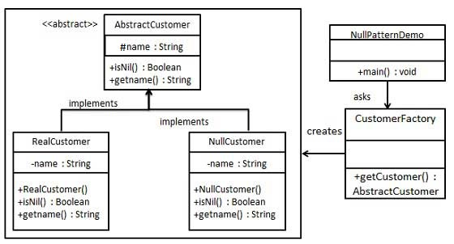

# Null Object Pattern Pattern

In Null Object pattern, a null object replaces check of NULL object instance. Instead of putting if check for a null value, Null Object reflects a do nothing relationship. Such Null object can also be used to provide default behaviour in case data is not available.

In Null Object pattern, we create an abstract class specifying various operations to be done, concrete classes extending this class and a null object class providing do nothing implemention of this class and will be used seemlessly where we need to check null value.

## Implementation

We are going to create a AbstractCustomer abstract class defining opearations. Here the name of the customer and concrete classes extending the AbstractCustomer class. A factory class CustomerFactory is created to return either RealCustomer or NullCustomer objects based on the name of customer passed to it.

NullPatternDemo, our demo class, will use CustomerFactory to demonstrate the use of Null Object pattern.



## Step 1

Create an abstract class.

_AbstractCustomer.java_

```java
public abstract class AbstractCustomer {
   protected String name;
   public abstract boolean isNil();
   public abstract String getName();
}
```

## Step 2

Create concrete classes extending the above class.

_RealCustomer.java_

```java
public class RealCustomer extends AbstractCustomer {

   public RealCustomer(String name) {
      this.name = name;		
   }
   
   @Override
   public String getName() {
      return name;
   }
   
   @Override
   public boolean isNil() {
      return false;
   }
}
```

_NullCustomer.java_

```java
public class NullCustomer extends AbstractCustomer {

   @Override
   public String getName() {
      return "Not Available in Customer Database";
   }

   @Override
   public boolean isNil() {
      return true;
   }
}
```

## Step 3

Create CustomerFactory Class.

_CustomerFactory.java_

```java
public class CustomerFactory {
	
   public static final String[] names = {"Rob", "Joe", "Julie"};

   public static AbstractCustomer getCustomer(String name){
   
      for (int i = 0; i < names.length; i++) {
         if (names[i].equalsIgnoreCase(name)){
            return new RealCustomer(name);
         }
      }
      return new NullCustomer();
   }
}
```

## Step 4

Use the CustomerFactory to get either RealCustomer or NullCustomer objects based on the name of customer passed to it.

_NullPatternDemo.java_

```java
public class NullPatternDemo {
   public static void main(String[] args) {

      AbstractCustomer customer1 = CustomerFactory.getCustomer("Rob");
      AbstractCustomer customer2 = CustomerFactory.getCustomer("Bob");
      AbstractCustomer customer3 = CustomerFactory.getCustomer("Julie");
      AbstractCustomer customer4 = CustomerFactory.getCustomer("Laura");

      System.out.println("Customers");
      System.out.println(customer1.getName());
      System.out.println(customer2.getName());
      System.out.println(customer3.getName());
      System.out.println(customer4.getName());
   }
}
```

## Step 5

Verify the output.

```
Customers
Rob
Not Available in Customer Database
Julie
Not Available in Customer Database
```

:octocat: [Check more about Design Patterns in my repository.](https://github.com/FernandoCalmet/Design-Patterns)

## Support me ☕💖

<a href='https://ko-fi.com/fernandocalmet' target='_blank'>
  
</a>
