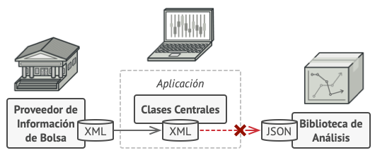

[![Github][github-shield]][github-url]
[![Kofi][kofi-shield]][kofi-url]
[![LinkedIn][linkedin-shield]][linkedin-url]
[![Khanakat][khanakat-shield]][khanakat-url]

# Patrón de Diseño Adapter

También llamado: Adaptador, Envoltorio, Wrapper

## Propósito

Adapter es un patrón de diseño estructural que permite la colaboración entre objetos con interfaces incompatibles.

## Problema

Imagina que estás creando una aplicación de monitoreo del mercado de valores. La aplicación descarga la información de bolsa desde varias fuentes en formato XML para presentarla al usuario con bonitos gráficos y diagramas.

En cierto momento, decides mejorar la aplicación integrando una inteligente biblioteca de análisis de una tercera persona. Pero hay una trampa: la biblioteca de análisis solo funciona con datos en formato JSON.

Podrías cambiar la biblioteca para que funcione con XML. Sin embargo, esto podría descomponer parte del código existente que depende de la biblioteca. Y, lo que es peor, podrías no tener siquiera acceso al código fuente de la biblioteca, lo que hace imposible esta solución.

## Solución

Puedes crear un adaptador. Se trata de un objeto especial que convierte la interfaz de un objeto, de forma que otro objeto pueda comprenderla.

Un adaptador envuelve uno de los objetos para esconder la complejidad de la conversión que tiene lugar tras bambalinas. El objeto envuelto ni siquiera es consciente de la existencia del adaptador. Por ejemplo, puedes envolver un objeto que opera con metros y kilómetros con un adaptador que convierte todos los datos al sistema anglosajón, es decir, pies y millas.

Los adaptadores no solo convierten datos a varios formatos, sino que también ayudan a objetos con distintas interfaces a colaborar. Funciona así:
  
1. El adaptador obtiene una interfaz compatible con uno de los objetos existentes.
2. Utilizando esta interfaz, el objeto existente puede invocar con seguridad los métodos del adaptador.
3. Al recibir una llamada, el adaptador pasa la solicitud al segundo objeto, pero en un formato y orden que ese segundo objeto espera.
  
En ocasiones se puede incluso crear un adaptador de dos direcciones que pueda convertir las llamadas en ambos sentidos.

## Estructura

### Adaptador de objetos

Esta implementación utiliza el principio de composición de objetos: el adaptador implementa la interfaz de un objeto y envuelve el otro. Puede implementarse en todos los lenguajes de programación populares.

### Clase adaptadora

Esta implementación utiliza la herencia, porque la clase adaptadora hereda interfaces de ambos objetos al mismo tiempo. Ten en cuenta que esta opción sólo puede implementarse en lenguajes de programación que soporten la herencia múltiple, como C++.

<!--- reference style links --->
[github-shield]: https://img.shields.io/badge/-@fernandocalmet-%23181717?style=flat-square&logo=github
[github-url]: https://github.com/fernandocalmet
[kofi-shield]: https://img.shields.io/badge/-@fernandocalmet-%231DA1F2?style=flat-square&logo=kofi&logoColor=ff5f5f
[kofi-url]: https://ko-fi.com/fernandocalmet
[linkedin-shield]: https://img.shields.io/badge/-fernandocalmet-blue?style=flat-square&logo=Linkedin&logoColor=white&link=https://www.linkedin.com/in/fernandocalmet
[linkedin-url]: https://www.linkedin.com/in/fernandocalmet
[khanakat-shield]: https://img.shields.io/badge/khanakat.com-brightgreen?style=flat-square
[khanakat-url]: https://khanakat.com