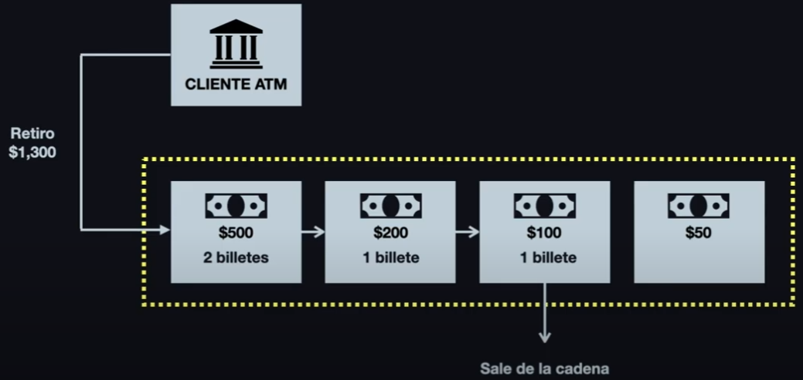

# Chain Of Responsability Pattern

> Ejemplo 1




## Probar

```bash
php index.php
```

## Resultado esperado

```bash

```

---
:octocat: [My Github](https://github.com/FernandoCalmet)

[](https://ko-fi.com/T6T41JKMI)
